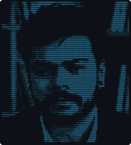
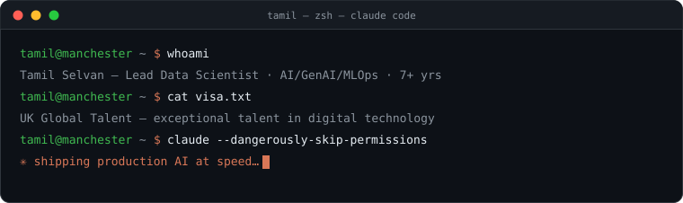

<table>
<tr>
<td width="24%" align="center" valign="middle">



</td>
<td width="76%" valign="middle">



<a href="https://git.io/typing-svg"></a>

[](https://www.linkedin.com/in/selva221724/)
[](https://stackoverflow.com/users/10383650/tamil-selvan)
[](https://medium.com/@selva221724)
[](mailto:selva221724@gmail.com)
[](https://myvisafit.com)

</td>
</tr>
</table>


<table>
<tr>
<td width="55%" valign="top">

```python
class TamilSelvan:
    role       = "Lead Data Scientist @ Vanquis Bank 🇬🇧"
    focus      = ["GenAI", "LLM Deployment",
                  "Agentic AI", "MLOps"]
    education  = ["MSc Robotics & Automation (UK)",
                  "MSc Electronics", "BSc Physics"]
    visa       = "UK Global Talent"
    workflow   = "claude code + codex, AI-native"
```

- **FCA commission redress pipeline** — 1.7M PDFs & scanned docs via SageMaker + Bedrock · **£170k saved** · **3.8 years → 1 month**
- **Dealer onboarding platform** — React + RAG (Haystack + FAISS) over FCA / Companies House / CreditSafe APIs · **40 hrs → seconds**
- **Entity resolution engine** — **96%** accuracy · **0.5M records/day**
- **CARNOT** — aerial thermography for renewables · **9 days → 6 hrs**

</td>
<td width="45%" align="center" valign="middle">


</td>
</tr>
</table>


| | project | what it does | |
|---|---|---|---|
| ✈️ | [myvisafit.com](https://myvisafit.com) | UK Global Talent Visa eligibility platform | `live` |
| 📮 | [UK-Postcode-MCP-Server](https://github.com/selva221724/UK-Postcode-MCP-Server) | UK postcode geocoding for AI agents | `MCP` |
| 📊 | [edaSQL](https://github.com/selva221724/edaSQL) | SQL bridge to exploratory data analysis | `11k+ ↓` |
| 📝 | [dummylog](https://github.com/selva221724/dummylog) | python log management | `9k+ ↓` |
| 📦 | [pypostalwin](https://github.com/selva221724/pypostalwin) | libpostal address parser for Windows | `6k+ ↓` |


```yaml
genai:    [GPT-4o, Claude, Gemini, Llama 3, LangChain, LangGraph, LlamaIndex, MCP, RAG, Fine-tuning]
ml_cv:    [PyTorch, TensorFlow, scikit-learn, XGBoost, Transformers, OpenCV, YOLO, spaCy, BERTopic]
vectors:  [ChromaDB, Pinecone, FAISS, MongoDB, Snowflake, SQL]
mlops:    [Docker, Kubernetes, Terraform, MLflow, Azure ML, AWS Bedrock, SageMaker, FastAPI, CI/CD]
tools:    [Claude Code, Codex, Streamlit, Supabase, Vercel, Git Workflows, PyTest]
```

<div align="center">

</div>


<div align="center">

 


<picture>
  <source media="(prefers-color-scheme: dark)" srcset="https://raw.githubusercontent.com/selva221724/selva221724/output/github-contribution-grid-snake-dark.svg"/>
  <source media="(prefers-color-scheme: light)" srcset="https://raw.githubusercontent.com/selva221724/selva221724/output/github-contribution-grid-snake.svg"/>
  
</picture>

<sub><code>physics → robotics → production AI · always shipping</code></sub>

</div>
